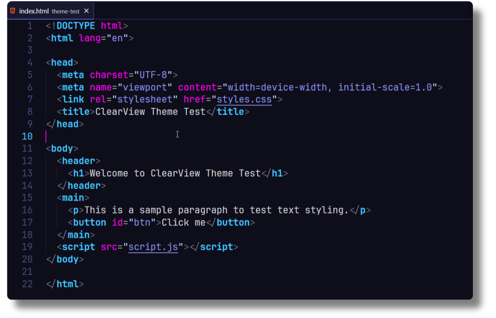
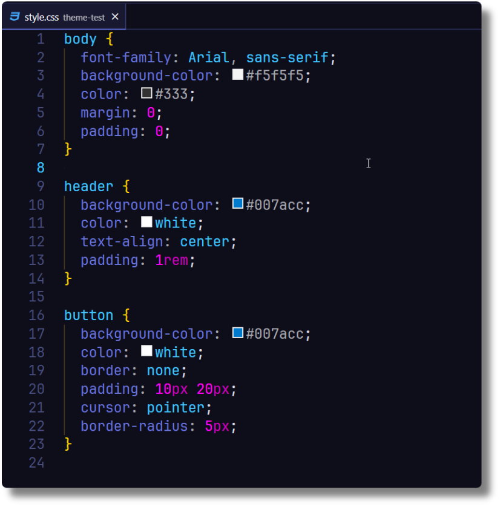
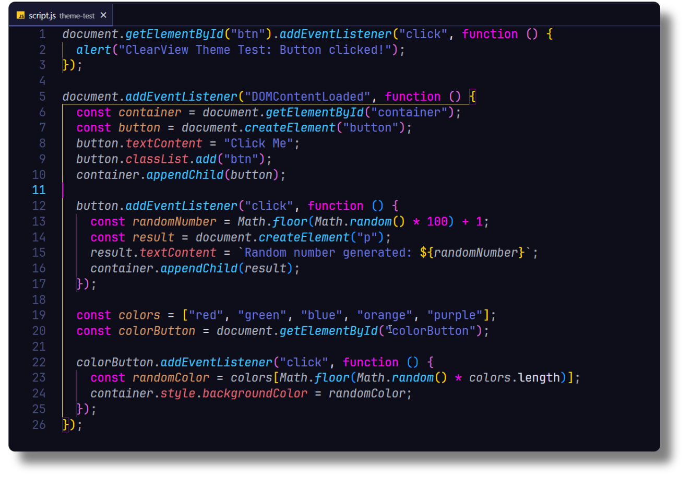

### A VS Code dark theme that combines elegant design and enhanced focus.

## ✨ Features

- 🌿 Clean and minimalistic design
- 🎨 Inspired color palette for better code readability
- 🔍 Syntax highlighting optimized for `HTML`, `CSS`, `Javascript`
- 🔍 Enhanced focus on important code elements

## ⚙️ Installation

1. Open **Extensions** sidebar panel in Visual Studio Code. `View → Extensions`
1. Search for `ClearView Dark`
1. Click **Install**
1. Click **Reload**

## 📚 Usage

➡️ `File > Preferences > Theme > Color Theme >` **ClearView Dark**

## What's new?

Click here to go to the [Changelog](https://github.com/devbytemehedi/clearview-vscode-theme/blob/main/CHANGELOG.md)

## 🖼️ Screenshots

### 📄 HTML

### 🎀 CSS

### 🚀 Javascript

## 🖋️ Fonts

I am using `JetBrainsMono Nerd Font Mono`. It is a free font get this from here [Nerdfonts](https://www.nerdfonts.com/font-downloads)

## 📝 Feedback

If you have suggestions, please [open an issue](https://github.com/devbytemehedi/clearview-vscode-theme/issues) or better yet, a [pull request](https://github.com/devbytemehedi/clearview-vscode-theme/pulls).

## 🙌 Credits

> This theme is inspiration from [Coder Coder Dark](vscode:extension/CoderCoder.codercoder-dark-theme) theme, Color Pallate is inspired form [Outrun](vscode:extension/hhochart29.outrun) theme and [Atom One Dark Theme](vscode:extension/akamud.vscode-theme-onedark).

## 👤 Author

Authored by [Mehedi Hasan](https://dub.sh/mhdev)

## License

[MIT License](./LICENSE)
